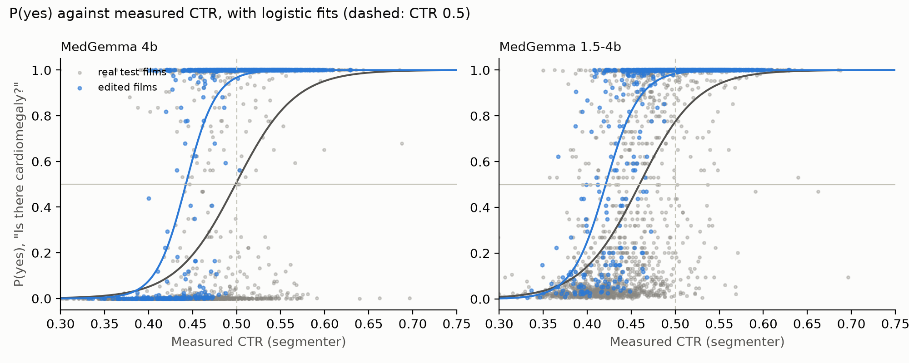

# cxr-grounding

Do medical vision-language models look at the X-ray? This project adds a finding (cardiomegaly or
pleural effusion) to normal chest X-rays with a diffusion editor (RadEdit), keeps only the edits
that pass automatic checks, and asks MedGemma the same yes/no question before and after the edit.

> Research project on public data. Not for clinical use.

**MedGemma's yes/no scores depend on the X-ray: of the edits that passed our automatic checks and
started below 0.5, 98.6-100% cross above it. For MedGemma 4B these are answer flips (its score agrees
with its written answer in 98.9-100% of the decoded answers that contain a yes or no); for MedGemma
1.5 they are score crossings. But the scores also react to how the editor paints a finding, not only
to the anatomy the edit was meant to change, so crossings on generated counterfactuals show that a
model uses the image, not that it reads the anatomy.**

An edit *passes our automatic checks* when an independent classifier (TorchXRayVision; the
PadChest-trained model, and for effusion also the CheXpert-trained one) scores it above its threshold
and higher than the original film, the anatomy agrees (cardiomegaly: the cardiothoracic ratio, CTR,
crosses 0.5; effusion: the aerated lung in the lung-base mask shrinks by at least 10%), and a
compositing check finds no change outside the edit mask (true by construction: the original pixels
are pasted back). Plan, pre-registered rules and lab notebook: [PLAN.md](PLAN.md).

## Results

MedGemma's score is P(yes) = sigmoid(d), with d the log-odds of the yes tokens against the no tokens
at the first answer position (float32, unrounded); a score crosses a threshold when the edited film's
P(yes) is above it and the original's below. Test split of NIH ChestX-ray14 (PA films), one
source film per patient; 308 of 380 cardiomegaly additions and 179 of 600 effusion additions passed
the checks (`results/pairs_test_summary.csv`).

**Crossings at 0.5 (the pre-registered secondary rule, `results/audit_flips.csv`).** Pairs that passed
the checks and whose original film has P(yes) < 0.5; a pair crosses when the edited film's P(yes) is
above 0.5. Shams use the same mask and edit path with a normal prompt, and the same 0.5 threshold.

| Model | Question | Additions crossing 0.5 | One-sided 95% lower bound | Shams crossing 0.5 |
|---|---|---|---|---|
| MedGemma 4B | Is there cardiomegaly? | 266/266 (100%) | 98.9% | 20.3% |
| MedGemma 4B | Is the heart enlarged? | 289/293 (98.6%) | 96.9% | 9.2% |
| MedGemma 4B | Is there pleural effusion? | 168/169 (99.4%) | 97.2% | 2.4% |
| MedGemma 4B | Is there fluid in the pleural space? | 163/163 (100%) | 98.2% | 4.9% |
| MedGemma 1.5 | Is there cardiomegaly? | 265/265 (100%) | 98.9% | 22.6% |
| MedGemma 1.5 | Is the heart enlarged? | 284/285 (99.6%) | 98.3% | 11.9% |
| MedGemma 1.5 | Is there pleural effusion? | 163/163 (100%) | 98.2% | 4.3% |
| MedGemma 1.5 | Is there fluid in the pleural space? | 158/158 (100%) | 98.1% | 3.8% |

Under the primary pre-registered thresholds (Youden's J on validation films), every eligible addition
crosses, in all 8 rows (n = 137-274). But for MedGemma 4B those thresholds are near 0 in three of its
four question settings (P(yes) 0.00001 to 0.00014; `results/audit_4b_thresholds.csv`), and 99.5-100%
of its blank images cross them too (`results/audit_controls.csv`): there the primary threshold cannot
separate an edit from noise, and the 0.5 rule above is the meaningful one. At 0.5, no blank or
shuffled image crosses, for either model (980 of each; largest P(yes) on a blank: 0.0045).

**What the edits change (exploratory, decided after the audit).**
- Asked for cardiomegaly inside the heart's own outline, RadEdit makes the heart denser (+12 gray
  levels inside the outline) but not wider (median CTR 0.430 -> 0.434), and the share of films
  MedGemma 4B answers "yes" (P(yes) > 0.5) rises from 14% to 39% (sham, same mask and threshold: 12%).
  After the smallest enlargement (CTR 0.456, still normal) it reaches 54% (`results/followup_heart_intensity.csv`,
  `dose_effect_by_growth.csv`, `followup_cardio_shams.csv`).
- On 31% of those films it answers "yes" to "Is there cardiomegaly?" but "no" to "Is the heart
  enlarged?" (both at 0.5), against 16% of real films, and never the reverse
  (`results/dose_phrasing_contradiction.csv`).
- At the same measured CTR, edited films get a higher P(yes) than real films, for both models (CI
  above 0 in 15 of 16 comparisons, resampling patients with their real and edited films together;
  `results/dose_matched_ctr.csv`).
- The thinnest effusion edit raises the share of films MedGemma 4B answers "yes" (P(yes) > 0.5) from
  3% to 56% while the aerated lung shrinks by 2.6%, below our own 10% check
  (`results/followup_effusion_dose.csv`).



## Limitations

- **MedGemma 1.5's score is a ranking score, not its answer.** It rarely starts its answer with yes
  or no (4-33% of real and edited films); read at the first yes or no of its full answer, when there
  is one, the answer agrees with its score for 78-93% of films, against 98.9-100% for MedGemma 4B
  (`results/decode_1.5-4b.csv`, `decode_4b.csv`).
- **The effusion screen is not specific to fluid**: it passes 22% of blur-only images (a Gaussian
  blur of the lung bases, sigma 8 px, no RadEdit; `results/followup_effusion_dose.csv`).
- **A tokenization bug, fixed and measured.** Until 2026-09-30 every MedGemma input carried two <bos>
  tokens. Re-scored with one: for 4B, AUROC moved by at most 0.013 and 97-99% of answers stayed on the
  same side of 0.5; for 1.5 the log-odds fell by 1.1-1.5 on average and 3.5-10.5% of scores changed
  side (`results/bos_check.csv`). Every number here comes from the re-scored run.
- **RadEdit's released pipeline** ignores the keep mask and, outside the edit mask, pastes back a
  latent one timestep too noisy (`results/radedit_bugcheck.csv`). We paste the original pixels back
  after decoding, which removes both effects outside the mask but not inside it. RadEdit was trained
  on NIH ChestX-ray14 with its own random, patient-disjoint train/validation split and no test split
  (its model card), so we do not know whether our patients were in its training set.
- **The test split is exploratory**: the edit settings and the analyses above were chosen after
  looking at it. H3 kept a fresh test set for that reason.
- Only additions: removals failed the checks (PLAN.md, lab notebook). The checks rely on models
  (classifiers, a segmenter whose CTR agrees with CheXmask at r = 0.893 on real films,
  `results/segmenter_ctr.csv`). One dataset, two findings, two models.

## H3: does fine-tuning on counterfactuals transfer to real films?

Pre-registered in [PLAN.md](PLAN.md) (section 4) before any training, with dated clarifications, one
of them added during training and recorded as such. MedGemma 4B was fine-tuned with LoRA on "Is
there cardiomegaly in this image?", labelled by the segmenter's CTR > 0.5: on real films (R), on
RadEdit edits only (E), or on both (RE), three seeds each. It was tested once, at the end, on
patients reserved for it: 2,335 real PA films of 1,187 patients, plus 600 edits, 100 shams and 100
blank images made from 100 of their normal films. Shares are of P(yes) > 0.5 (fine-tuned models'
written answers were not decoded).

**Training only on edits recovers about two-thirds of the real-data gain on real films; adding the
edits to real-film training adds nothing.**

Fresh test set, mean of 3 seeds (range over seeds), `results/h3_arms_fresh.csv`:

| | Base | R: real films | E: edits only | RE: both |
|---|---|---|---|---|
| Real films, CTR-AUROC (primary) | 0.900 | 0.937 (0.934-0.940) | 0.925 (0.920-0.927) | 0.937 (0.936-0.937) |
| Real films, AUROC against NIH labels | 0.931 | 0.935 (0.932-0.938) | 0.931 (0.921-0.936) | 0.933 (0.932-0.935) |
| Edits, Brier score (lower is better) | 0.303 | 0.138 (0.121-0.148) | 0.074 (0.069-0.077) | 0.073 (0.063-0.082) |
| Edits with CTR <= 0.5, P(yes) > 0.5 | 50% | 28% (23-33%) | 9% (7-10%) | 13% (9-15%) |
| Shams, P(yes) > 0.5 | 19% | 16% (16-17%) | 5% (4-6%) | 9% (8-10%) |
| Blank images, P(yes) > 0.5 | 0% | 0% | 0% | 0% |

- **H3.1, "E moves real films much less than R does": inconclusive, as pre-registered.** R improves
  real films (CTR-AUROC +0.037, 95% CI 0.025 to 0.050; bar 0.020) and E learns its edits
  (edited-film Brier gain +0.229, CI 0.191 to 0.268; bar 0.061). But E's real-film gain, +0.025
  (CI 0.015 to 0.035), is 0.67 of R's: D = R's gain - 2 x E's gain = -0.013 (CI -0.027 to +0.002).
  The estimate leans against our prediction (that E would gain less than half as much as R), but
  its interval includes 0. D stays negative with the CheXmask label (-0.049), within NIH finding
  status (-0.005) and with E's checkpoint chosen on real films (-0.012)
  (`results/h3_contrasts_fresh.csv`, `h3_verdicts_fresh.csv`).
- **H3.2, "RE is no better than R": supported.** RE - R = -0.0005 CTR-AUROC (CI -0.005 to +0.004),
  no gain as large as the pre-registered 0.02 margin.
- **The exploratory test split overstated E:** there, E's real-film gain was 0.79 of R's, against
  0.67 on the fresh set (`results/h3_verdicts_test.csv`).
- **Guards:** no fine-tuned model gives a blank image P(yes) > 0.5, and effusion AUROC does not drop
  (it rises for R and RE). Training on real films alone lowers the share of edits with CTR <= 0.5
  above 0.5 from 50% to 28%; training on edits brings it to 9%.

Limitations of H3: the training labels and the primary metric both come from the segmenter's CTR, a
surrogate for cardiomegaly (the independent CheXmask CTR points the same way, and the NIH-label AUROC
barely moves); cardiomegaly only; one editor (RadEdit) and one model (MedGemma 4B), three seeds; LoRA
adapts only the language model, with the vision encoder frozen, so H3 asks what the language model
can learn from the image features MedGemma already produces. Fine-tuning lowers the probability on
yes or no as the first token (median on real films: base 0.985, E 0.888), so these are conditional
yes/no scores, not decoded answers.

## Layout

```
cxr/                all the Python, one file per stage, run as: python -m cxr.<stage>
  __init__.py       shared paths
  data.py           NIH subset, CheXmask landmarks, cardiothoracic ratio (CTR), patient splits
  checks.py         edit checks: TorchXRayVision classifiers and segmenter, validated on real films
  edit.py           RadEdit additions and shams, masks from CheXmask, the three checks
  audit.py          MedGemma scores (log-odds), flip rule, controls, decode and <bos> checks
  dose.py           dose-response, blur control, follow-up measures
  h3.py             H3 training data (manifests, pinned model revisions)
  lora.py           H3: LoRA training, checkpoint checks, evaluation (identity-checked, fresh set once)
  reader.py         pilot reader study: image selection and the blinded rating page
  provenance.py     records kept before deleting the pod volume: images decoded, H3 manifests, environment
notebooks/          analysis on the Mac, reading only results/ (01 data, 03 audit, 03b dose, 03c follow-up,
                    04 H3 orientation, 05 H3 evaluation: test split, fresh set)
pod/                the GPU pod (RunPod): sync, setup, run in tmux, watchdog, provenance
results/            small tables and figures (in git)
PLAN.md             plan, pre-registrations and lab notebook
```

Only on the pod's network volume, not in git: `data/` (datasets), `outputs/` (per-image tables,
generated images), the Python environment, the Hugging Face cache and the logs.

## Run it (RunPod)

One GPU pod from the Runpod PyTorch 2.8.0 template (`runpod/pytorch:1.0.2-cu1281-torch280-ubuntu2404`)
with a network volume at `/workspace`; put the pod's SSH address in `~/.ssh/config` as host `cxr-pod`.

```bash
bash pod/sync.sh push                                    # Mac: code -> pod
ssh cxr-pod bash /workspace/cxr-grounding/pod/setup.sh   # every new pod
ssh -t cxr-pod 'source /workspace/cxr-grounding/pod/env.sh && hf auth login'   # once: gated models
R="bash /workspace/cxr-grounding/pod/run.sh"             # long runs in tmux, logged in /workspace/logs
ssh cxr-pod "$R data 'bash pod/data.sh'"                                    # data, CTR, 512-px subset
ssh cxr-pod "$R checks 'python -m cxr.checks validate'"                     # checks on real films
ssh cxr-pod "$R generate 'python -m cxr.edit generate --split test'"        # additions and shams
ssh cxr-pod "$R audit 'python -m cxr.audit run --model 4b && python -m cxr.audit run --model 1.5-4b'"
ssh cxr-pod "$R dose 'python -m cxr.dose run && python -m cxr.dose followup'"
ssh cxr-pod "$R h3gen 'python -m cxr.h3 generate && python -m cxr.h3 measure'"   # H3 training data
ssh cxr-pod "$R h3train 'python -m cxr.lora train --arm R --seed 0'"             # each arm R, E, RE, seed 0-2
ssh cxr-pod "$R h3final 'python -m cxr.lora runs && python -m cxr.lora evaluate --model base --set fresh --final'"  # then each model
bash pod/sync.sh pull                                    # Mac: results/ <- pod, then run the notebooks
```

Every stage skips finished work, so an interrupted run is simply started again. Most stages decide
that work is finished from the existence of its output files, not from a hash of their inputs,
settings and code: delete a stage's outputs before rerunning it with other code or settings. The
exceptions are H3's final evaluation (`cxr.lora evaluate` and `runs` check the commit, the pushed
code, the settings, the input images and the adapters by hash) and the H3 generation folders
(manifests with the settings and model revisions). The published results were produced and checked
before this was documented (PLAN.md, lab notebook).

## License, data and models

The code is under the MIT License ([LICENSE](LICENSE)). No dataset or model weights are included;
each keeps its own terms:

- **NIH ChestX-ray14**, PA films only, from a Hugging Face mirror of the NIH release
  (`alkzar90/NIH-Chest-X-ray-dataset`). Wang X, Peng Y, Lu L, Lu Z, Bagheri M, Summers RM.
  ChestX-ray8: Hospital-scale chest X-ray database and benchmarks on weakly-supervised
  classification and localization of common thorax diseases. CVPR 2017.
- **CheXmask** v1.0 (PhysioNet, CC BY 4.0): heart and lung contours; the downloaded file is checked
  against PhysioNet's SHA-256. Gaggion N, Mosquera C, Mansilla L, et al. CheXmask: a large-scale
  dataset of anatomical segmentation masks for multi-center chest x-ray images. Scientific Data 11,
  511 (2024).
- **RadEdit** (`microsoft/radedit`): research use only; weights not included or redistributed.
- **MedGemma** (`google/medgemma-4b-it`, `google/medgemma-1.5-4b-it`): Health AI Developer
  Foundations terms; weights not included.
- **TorchXRayVision**: PadChest- and CheXpert-trained classifiers and the ChestX-Det segmenter, as
  independent checks of the edits.
